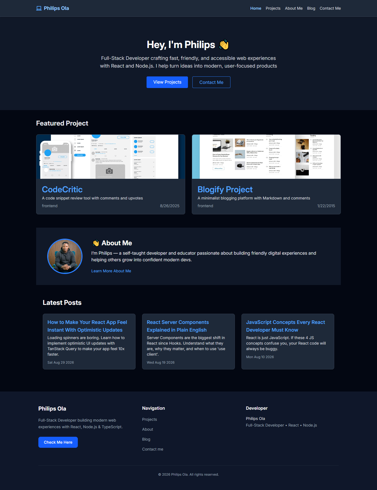
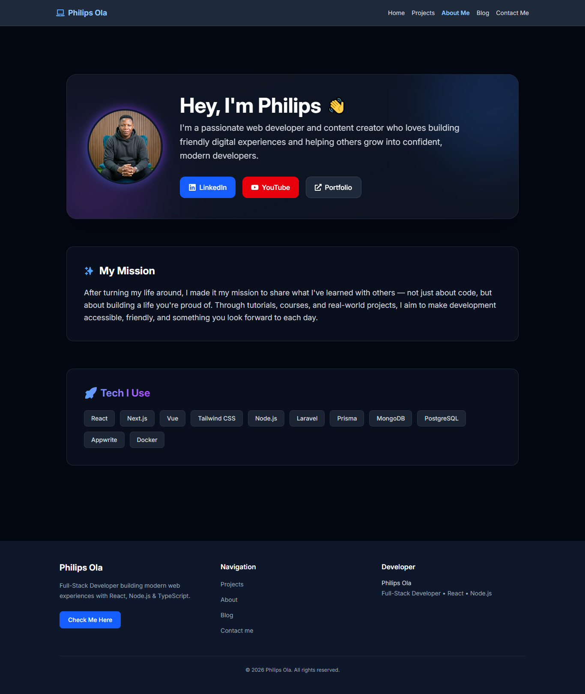
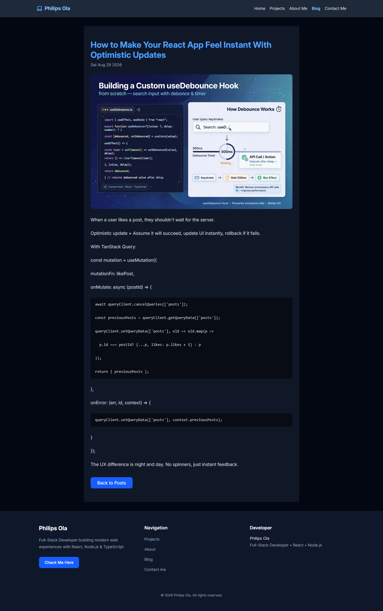
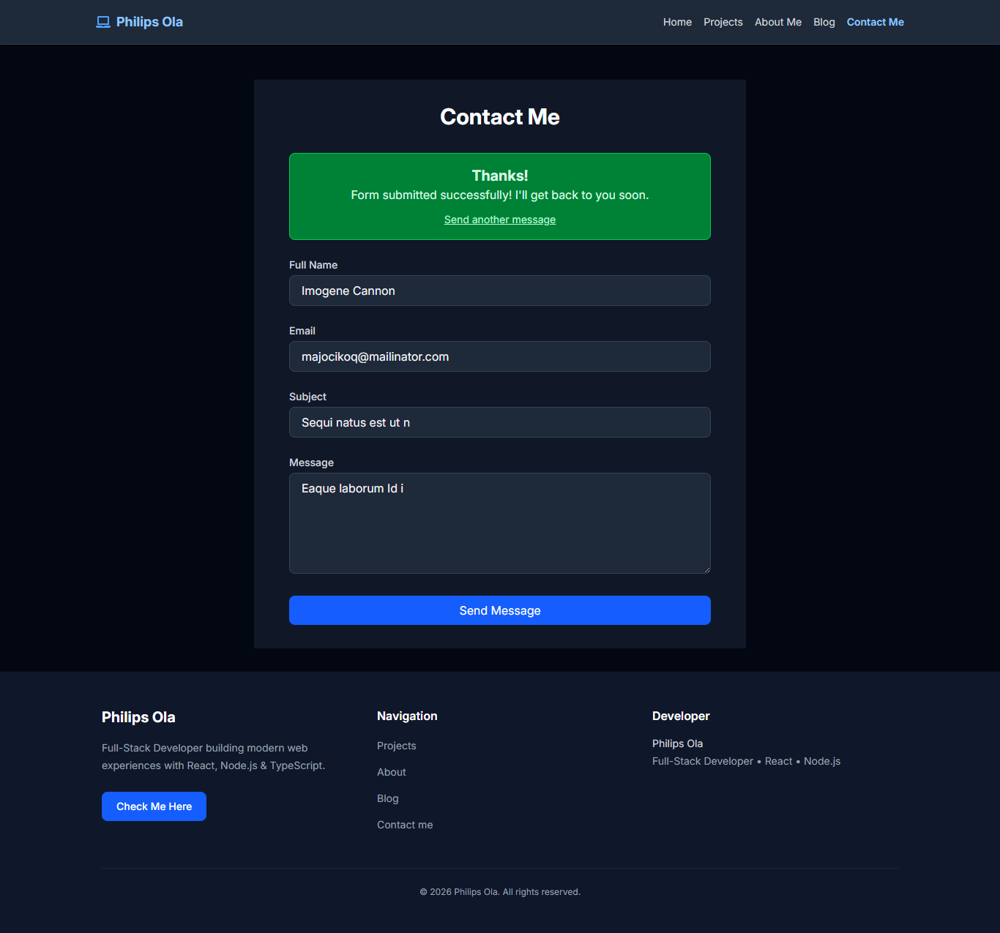

# Philips Ola Portfolio

A modern personal portfolio and blog website built with React Router, Vite, TypeScript, and a Strapi-powered headless CMS. This project showcases my work, writing, and contact information in a clean and responsive single-page experience.

Live site: https://philipsola.vercel.app/

## Overview

This portfolio is designed to present a developer brand in a polished, professional way while keeping content flexible and easy to update. The site includes:

- A modern home landing page
- Featured project showcase
- Full projects archive with category filtering and pagination
- Blog listing and detail pages
- About page with personal bio and links
- Contact form integration
- Content powered by Strapi CMS for easy maintenance

## Tech Stack

Frontend
- React 19
- Vite
- TypeScript
- React Router 7
- Tailwind CSS
- Framer Motion
- React Icons

CMS / Data
- Strapi
- REST API integration

Deployment
- Render(Backend)
- Vercel(Frontend)

## Features

### Portfolio sections
- Hero section with call-to-actions
- Featured work highlights
- Individual project details with external live link
- Responsive navigation for mobile and desktop

### Blog experience
- Searchable blog posts
- Post cards with excerpts and dates
- Detailed blog content pages
- CMS-managed content

### Contact experience
- Client-side validation
- Form submission via Formspree
- User-friendly success and error states

### Content management
- Projects and posts retrieved from Strapi
- Support for image fields and rich content
- Easy future expansion for new sections

## Live Demo

- Production URL: https://philipsola.vercel.app/

## Screenshots

### Landing page



### About page



### Projects page


### Single project page


### Post page


### Single post page



### Contact page



## Project Structure

```bash
react-portfolio-frontend/
├── app/
│   ├── components/
│   ├── routes/
│   ├── posts/
│   ├── root.tsx
│   ├── routes.ts
│   └── types.ts
├── public/
│   └── images/
├── docs/
│   └── screenshots/
├── package.json
├── vite.config.ts
├── react-router.config.ts
├── tsconfig.json
├── Dockerfile
└── README.md
```

## Environment Variables

Create a `.env` file in the root of the project for local development:

```bash
VITE_STRAPI_URL=https://your-strapi-instance-url
```

This variable is used to fetch project and blog data from your Strapi backend.

## Getting Started

### Prerequisites

- Node.js 18+
- npm or pnpm
- A running Strapi instance (if you want live content)

### Install dependencies

```bash
npm install
```

### Start the development server

```bash
npm run dev
```

The app will run locally in development mode with hot reloading.

### Production build

```bash
npm run build
```

### Run production build locally

```bash
npm run start
```

## Deployment on Vercel

This project is configured for Vercel deployment using the React Router Vercel preset.

### Recommended deployment steps

1. Push the project to GitHub.
2. Import the backend repository into render
2. Import the frontend repository into Vercel.
3. Set the project root to the frontend app directory if it is nested inside a monorepo or parent folder.
4. Ensure the build command is:

```bash
npm run build
```

5. Add the required environment variables in Vercel:

```bash
VITE_STRAPI_URL=https://your-strapi-url
```

6. Deploy.

## Notes

- The site uses Strapi as a content layer, so data updates can be managed without redeploying the frontend for simple content changes.
- If your Strapi URL or content fields change, update the API calls in the route loaders accordingly.
- The design is responsive and intended to work across desktop and mobile breakpoints.

## Author

Philips Ola

Full-stack developer and technical content creator focused on building practical, modern user experiences.

## Let's Connect

- Portfolio: https://philipsola.vercel.app/
- LinkedIn: https://linkedin.com/in/olaphilips
- YouTube: https://youtube.com/@idtechnol
- Website: https://olaphilips.com.ng
